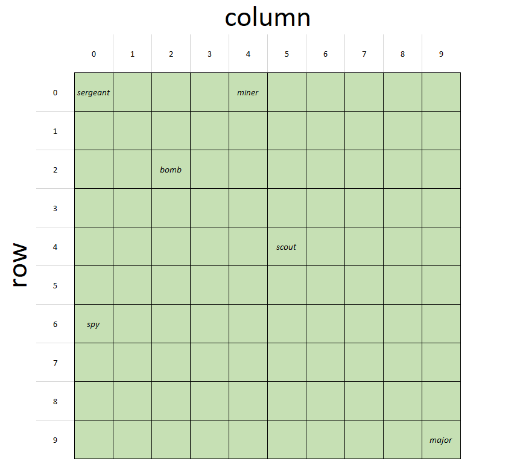
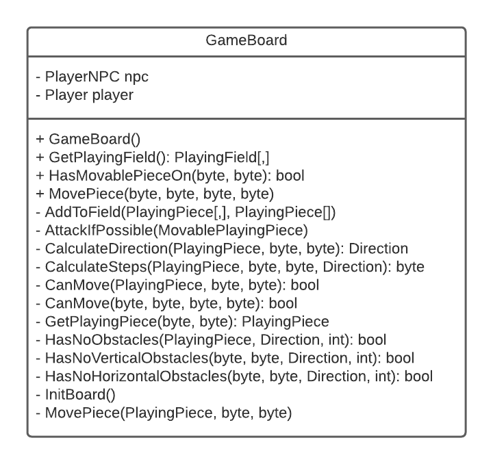
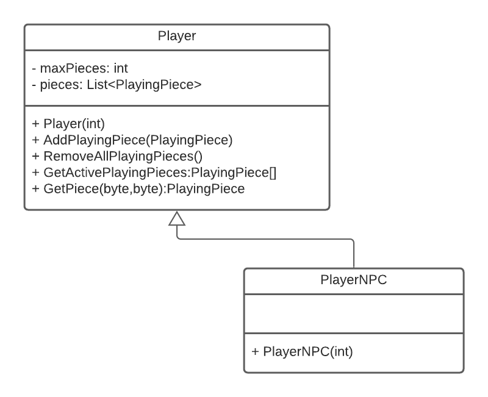
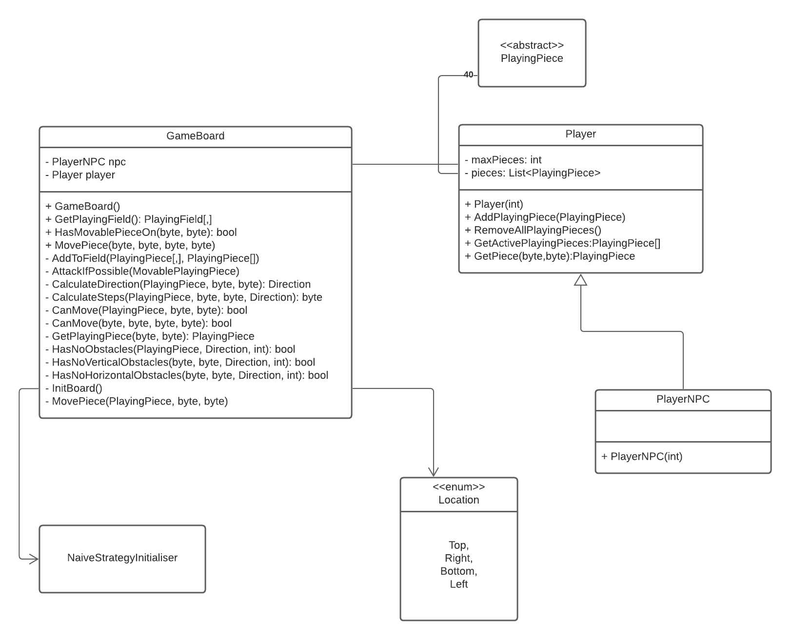

# Programming expert: Stratego

## Doelstellingen
- 1.1.2. Definieert criteria waar rekening mee gehouden wordt bij het uitwerken van het plan van aanpak
- 1.2.2. Beschrijft de nodige knowhow om het softwareproject uit te werken
- 1.2.3 Weegt verschillende oplossingen af in functie van verschillende parameters
- 1.3.1. Somt de mogelijke vereisten op binnen het kader van een afgebakende opdracht
- 2.1.1. Somt de technische vereisten op
- 2.1.2. Geeft mogelijke infrastructuur weer
- 2.2.2. Weegt mogelijke infrastructuur af
- 2.2.4. Identificeert welke informatie ontbreekt en noodzakelijk is voor het project
- 3.2.9. Interpreteert een gemaakte analyse
- 6.2.1. Beschrijft de nodige testscenario's op basis van de aangereikte projectanalyse

## Stratego

Voor deze PE-opdracht zullen jullie een implementatie maken van het welbekende spel `Stratego` waarvan je de spelregels [hier](Stratego.pdf) nog eens kan nalezen.

Dit is een groepsopdracht die je uitwerkt per 2. Als basis worden de groepslijsten genomen zoals die opgesteld werden via [leho](https://leho.howest.be).

Samenwerken in teams is niet altijd even makkelijk. Als je vaststelt dat het groepsproces niet verloopt zoals gewenst, dan is het van belang dat je hier zo snel mogelijk iets aan doet.

Meeliftgedrag wordt niet getollereerd. We verwachten van iedereen tijdens de opleiding een faire, actieve rol en houding.
Afwachten tot het vanzelf beter wordt is doorgaans geen oplossing en vergroot alleen de frustratie. Probeer elkaar steeds eerst aan te spreken en te praten over wat fout loopt (denk hierbij ook aan de waarden van Scrum). 

Neem pas contact op met je lector nadat je zelf geprobeerd hebt de samenwerking te verbeteren, maar wacht uiteraard ook niet te lang.

## Deel 1: Klassendiagram (6 punten)

Wij hebben voor jullie een klassendiagram uitgetekend (zie [klassendiagram.pdf](klassendiagram.pdf) ). Dit klassendiagram, samen met de spelregels en dit document, zou voldoende moeten zijn om een groot deel van de functionaliteit van het spel te implementeren. Het zal echter nog niet mogelijk zijn om het spel effectief te spelen, dat volgt pas in deel 2.

Jullie opdracht bestaat eruit om het gegeven klassendiagram om te zetten in code. Er werd reeds een solution `Stratego` voorzien met daarin een class library project `Stratego.Core`. Dit project bevat nog geen klassen (die moeten jullie aanmaken) maar wel al drie mappen:

- `Enums`: hierin komen de enums die in het klassendiagram gedefinieerd werden.
- `Interfaces`: deze map bevat de verschillende interfaces.
- `Pawns`: de klassen die de pionnen implementeren, inclusief de (abstracte) basisklassen, komen hier terecht.

Alhoewel we deze mappen gebruiken om het overzicht te bewaren, zorg je ervoor dat alle klassen, interfaces en enums in dezelfde namespace `Stratego.Core` zitten. Dit is belangrijk opdat de door jullie geschreven code eenvoudig kan ingeplugd worden in de aanvullende code die je van ons krijgt in deel 2 (zie verder).

### Aandachtspunten

Wat extra verduidelijking bij sommige onderdelen van het klassendiagram:
- De variabelen `row` en `column` uit de klasse `PlayingPiece` zeggen waar op het bord het stuk staat. Hierbij komt `row` overeen met de rij en `column` met de kolom waar het stuk staat. Het vak linksboven komt dus overeen met rij 0 en kolom 0. Hieronder vind je nog enkele voorbeelden.

  

  |piece | row | column |
  |--|--|--|
  |sergeant | 0 | 0 |
  |miner | 0 | 4 |
  |bomb |2| 2
  |scout |4| 5
  |spy |6| 0
  |major |9| 9

  Met deze informatie zou je moeten kunnen bepalen wat er met de row- en column-variabelen gebeurt wanneer een stuk verplaatst wordt.

- De constructoren van `PlayingPiece` en `MoveablePlayingPiece` hebben **5 parameters**:
    - De naam van het stuk (`miner`, `bomb`, `major`,...)
    - Het rijnummer waarop het stuk geplaatst wordt bij het begin van het spel
    - Het kolomnummer waarop het stuk geplaatst wordt bij het begin van het spel
    - De `rank` (rang) van het stuk (zie spelregels)
    - De kleur van het stuk

- De constructoren van de klassen die een concreet stuk voorstellen, hebben **3 parameters**:
    - Het rijnummer waarop het stuk geplaatst wordt bij het begin van het spel
    - Het kolomnummer waarop het stuk geplaatst wordt bij het begin van het spel
    - De kleur van het stuk

- Denk niet alleen goed na over het algemene gedrag (en de interactie) van `Attack` en `Defend`, maar houd ook rekening met wat je waar implementeert.
  Je zal deze methoden op sommige plaatsen moeten overschrijven om de uitzonderingsregels voor specifieke pionnen te weerspiegelen.
  Zorg ervoor dat dit zo eenvoudig mogelijk wordt gerealiseerd.

## Deel 2: Gameplay (10 punten)

Voor het tweede deel van de opgave krijg je een WPF-project en enkele nieuwe klassen van ons. Het is aan jullie om er voor te zorgen dat je het spel kan opstarten, gebruikmakend van de nieuwe klassen. Het zou mogelijk moeten zijn om de blauwe speler zetten te laten doen. De rode speler kan nog geen zetten kan doen deze logica zit verwerkt in de stories die jullie kunnen uitwerken als team.

Het kan voorvallen dat je initieel nog foutboodschappen krijgt. **Indien dit het geval is, is het niet de bedoeling dat je onze code wijzigt.** Dat betekent dat er iets misgelopen is met jullie implementatie in deel 1. Pas enkel onze code aan om de extra functionaliteiten te implementeren (zie verder).

Het is niet de bedoeling dat je alle code snapt die we jullie gegegeven hebben. Zorg vooral dat je de code in grote lijnen snapt, om jullie daarbij te helpen kun je onder het stukje Appendix heel wat informatie vinden over de gegeven code. Lees dat dus zeker goed door.

Jullie opdracht bestaat erin om enkele uitbreidingen te implementeren. Op [LEHO](https://leho.howest.be) vinden jullie een lijst waaruit je er enkele moet kiezen. Aangezien sommige zaken moeilijker zijn dan andere, hebben we een gewichtsscore toegekend aan ieder item. Je moet deze score zo interpreteren:

*De gewichtsscore van een uitbreiding is het **maximaal** aantal punten dat je kan verdienen bij het implementeren van deze uitbreiding. Je verdient natuurlijk enkel het maximaal aantal punten als het volledig op een juiste manier geïmplementeerd is. Probeer dus **niet** gewoon genoeg functionaliteiten te implementeren om aan een totale gewichtsscore van 5 te komen om net geslaagd te zijn voor dit deel, maar implementeer (meer dan) voldoende uitbreidingen zodat je verwacht ruimschoots geslaagd te zijn zonder per se een maximale score te krijgen op elk onderdeel.*

**Belangrijk:** zorg er ook steeds voor dat het klassendiagram van de applicatie aangepast wordt zodat jullie wijzigingen er in opgenomen zijn. De aangepaste klassendiagrammen dien je in als PDF-bestanden op Leho (bij de Stratego groepsopdracht). Je dient per story een apart klassendiagram in met duidelijk vermelding van de user story in kwestie.

## Workflow (4 punten)

Alhoewel we voor dit project nog niet volledig Scrum gaan werken — dat zullen jullie doen in de module Workplace Simulation (WSI) — vragen we jullie nu reeds om enkele aspecten van deze workflow toe te passen:

- Gebruik **Issues** op GitHub om user stories voor te stellen die je gaat implementeren. Voorzie bij elke user story een **omschrijving** en **acceptatiecriteria** (checklist).
- Voorzie een **inschatting** bij elke story, in de vorm van **story points** gekozen uit: **0, 1, 2, 3, 5, 8 of 13**. Alhoewel story points eigenlijk geen tijdseenheden zijn,
  maar een abstracte maat voor relatieve complexiteit, kan het helpen om er als startpunt van uit te gaan dat 1 story point overeen komt met +/- 1 uur werk.
  Tijdens het project zal je hier dan misschien van gaan afwijken o.b.v. voortschrijdend inzicht.
- Maak een **Project** op GitHub met swimlanes **"To do"**, **"In Progress"**, **"In Review"** en **"Done"**. Stories die je gaat uitwerken ken je eerst steeds toe
  aan dit project, zodat je de status kan opvolgen in het project board. Je kan de status manueel bijhouden door de stories steeds in de juiste kolom te slepen, of
  eventueel automatisaties configureren. Je mag dit zelf organiseren, in onderling overleg. Wij verwachten dat we op elk moment een mooi overzicht kunnen zien van de
  stories die in ontwikkeling zijn en hun status.
- **Assign** elke story steeds aan de persoon die de implementatie ervan voor zijn/haar rekening neemt.
- Werk elke story uit op een **aparte branch** waarvan de naam verwijst naar de story. Wanneer de story klaar is om gemerged te worden, open je een **Pull Request** op GitHub
  en laat je de andere persoon **reviewen** (duid deze ook aan als reviewer op de pull request). Na review kan je de pull request **mergen** en eventueel de branch verwijderen.
- **Tip:** maak waar mogelijk gebruik van keywords zoals `Closes #12` in je commit messages en/of pull request omschrijvingen, zodat issues automatisch worden afgesloten
  wanneer de pull request wordt gemerged.

Wil je nog eens opfrissen hoe je deze zaken kan doen? Dit kan je nalezen in hoofdstuk 3 (branches) en hoofdstuk 4 (GitHub) van de cursus Continuous Integration Basics.

## Appendix

### Matrices in c#

Op verschillende plaatsen in de code wordt gebruik gemaakt van C# matrices om het spelbord voor te stellen. Aangezien jullie nog niet met matrices gewerkt hebben, vind je hieronder hoe je een matrix aanmaakt, een object op een bepaalde positie plaatst en het object op een bepaalde rij en kolom kunt ophalen.

Een matrix lijkt heel goed op een array. In tegenstelling tot een array, bevat een matrix een horizontale EN een verticale richting. Je zal zien dat de notatie dan ook erg lijkt op het werken met arrays, alleen wordt een positie in een matrix aangeduid door 2 getallen in plaats van 1. Een getal dat zegt op welke rij een element staat en een getal dat zegt op welke kolom een element staat.

```csharp
//maak een matrix van objecten van het type PlayingPiece aan. Deze matrix heeft 5 rijen en 3 kolommen.
PlayingPiece[,] board = new PlayingPiece[5, 3];
//Maak een nieuwe bom aan en plaats die op rij 4 en kolom 3 van het spelbord. We tellen vanaf O!
board[3][2] = new Bomb(3, 2, PieceColor.Red);
//Kijk welk stuk er staat op rij 4 en kolom 3 en stop het in een variable p
PlayingPiece p = board[3][2];
```

### De klasse GameBoard



Hier zijn enkele dingen bij op te merken. De constructor zorgt ervoor dat alle stukken op het bord terecht komen (dit gebeurt momenteel random, op de vlag na). 

`HasMoveablePieceOn` heeft twee parameters die een rij- en een kolomnummer zijn. Deze methode geeft terug of er een verplaatsbaar stuk (dus geen bom of vlag) op die locatie staat.

`CanMove` en `MovePiece` hebben beide 4 parameters van het type byte. De eerste twee komen overeen met het rij- en kolomnummer van het stuk dat je wil verplaatsten en de laatste twee met het rij- en kolomnummer waar je het stuk wil plaatsen. `CanMove` controleert of dat een geldige zet is (hier zijn heel wat voorwaarden voor). De `MovePiece` methode zal dan de verplaatsing uitvoeren.

Het returntype van de `GetPlayingField` methode is een matrix van objecten van de klasse `PlayingPiece`. Deze stelt dus het spelbord voor.

### Player



De klasse `Player` stelt een speler voor. De klasse `PlayerNPC` stelt een *niet-spelende speler* voor en dus eigenlijk de computer waar tegen je speelt. Momenteel bevat die nog geen extra functionaliteit, je zal dan ook zien dat de tegenspeler nog geen zetten doet als je het spel speelt.

Het belangrijkste is dat een object van de klasse *Player* een lijst bevat van alle pionnen van die speler. Let er op dat ook de gevangen pionnen daarbij zitten - de informatie of een pion gevangen is of niet zit namelijk in de pion zelf.

De constructor van deze klasse krijgt een int mee die het maximum aantal stukken van die speler voorstelt (volgens de standaard regels zijn dat er 40) en heeft nog enkele extra methodes:

- `AddPlayingPiece` voegt een stuk toe aan de speler
- `RemoveAllPlayingPieces` verwijdert alle stukken van de speler (dus ook de niet-gevangen pionnen) 
- `GetActivePlayingPieces` geeft een array terug van alle niet-gevangen pionnen
- `GetPiece` geeft het stuk terug op een bepaalde rij en kolom. Deze informatie wordt niet rechtstreeks bijgehouden in `Player` maar wel in de afzonderlijke stukken.

### NaiveStrategyInitialiser

Deze klasse zal de stukken toevoegen aan een speler. De `NaiveStrategyInitialiser` is dus verantwoordelijk om te beslissen waar op het bord de pionnen initieel terecht komen. De belangrijkste methode hier is de constructor.

```csharp
public void InitialisePieces(Player player, Location location, byte boardWidth, int numPieces, PieceColor pieceColor)
```

De parameters hebben de volgende betekenissen:

- `player`: de speler waarvan je de stukken op het bord wil plaatsen
- `location`: de positie op het bord waar de stukken terecht moeten komen (`Top` of `Bottom`)
- `boardWidth`: de breedte van het spelbord (voor een standaardbord is dit dus 10)
- `numPieces`: het aantal stukken dat de speler heeft (voor het standaardspel is dit dus 40)
- `pieceColor`: de kleur van de pionnen van de speler

De `NaiveStrategyInitializer` is zo geïmplementeerd dat dit gewoon random gebeurt (enkel de vlag wordt op een specifieke plaats gezet).

### Overzicht


# PRE-Stratego
